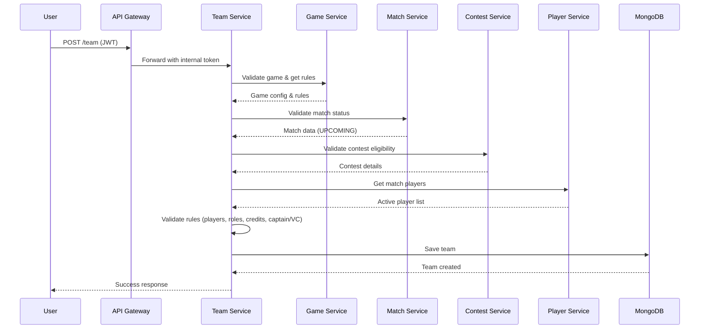

<div align="center">

# 👥 Team Microservice


### Power11 Fantasy Sports Platform

<br/>

[](https://nodejs.org/)
[](https://expressjs.com/)
[](https://www.mongodb.com/)
[](https://mongoosejs.com/)
[](https://www.docker.com/)

<br/>

**👥 Teams** · **✅ Validation** · **👑 Captain/Vice-Captain** · **🔗 Service Integration** · **💰 Credit System**

*Enterprise-grade fantasy team creation and management microservice with intelligent validation, dynamic captain selection, and seamless inter-service communication.*

</div>

---

## 📖 Overview

The **Team Microservice** is a core component of the Power11 Fantasy Sports Platform, responsible for **fantasy team creation, validation, and management**. Built with a layered architecture, it ensures data integrity through comprehensive validation, coordinates with multiple microservices, and provides a robust API for team operations.

### 🎯 Core Capabilities

| Capability | Description |
|:-----------|:------------|
| 🎮 **Team Creation** | Create fantasy teams with intelligent player selection and validation |
| ✅ **Rule Enforcement** | Real-time validation of composition rules, credits, and player eligibility |
| 👑 **Captain/VC System** | Dynamic captain (2x) and vice-captain (1.5x) point multiplier management |
| 🔄 **Team Management** | Full CRUD operations with atomic updates and rollback support |
| 🔗 **Service Orchestration** | Secure integration with Game, Match, Contest, and Player services |
| 💾 **Data Persistence** | Optimized MongoDB schema with indexing for high-performance queries |

---

## ✨ Key Features

<table>
<tr>
<td align="center">🎯</td>
<td><b>Smart Team Creation</b></td>
<td>11-player team builder with real-time validation against game rules</td>
</tr>
<tr>
<td align="center">✏️</td>
<td><b>Team CRUD Operations</b></td>
<td>Complete lifecycle management - create, read, update, and delete teams</td>
</tr>
<tr>
<td align="center">✅</td>
<td><b>Multi-Layer Validation</b></td>
<td>
  • Player count validation<br/>
  • Role composition rules<br/>
  • Credit budget management<br/>
  • Captain/VC constraints<br/>
  • Contest eligibility checks
</td>
</tr>
<tr>
<td align="center">👑</td>
<td><b>Captain Selection</b></td>
<td>Strategic captain (2x) and vice-captain (1.5x) point multipliers</td>
</tr>
<tr>
<td align="center">📊</td>
<td><b>Player Snapshots</b></td>
<td>Immutable player data capture at team creation for historical accuracy</td>
</tr>
<tr>
<td align="center">🔒</td>
<td><b>Security First</b></td>
<td>JWT authentication + internal service token validation</td>
</tr>
<tr>
<td align="center">🚀</td>
<td><b>High Performance</b></td>
<td>Indexed database queries and efficient service-to-service communication</td>
</tr>
<tr>
<td align="center">🐳</td>
<td><b>Docker Ready</b></td>
<td>Containerized deployment with optimized Alpine Linux base</td>
</tr>
</table>

---

## 🏗️ System Architecture

```
                              ┌─────────────────────┐
                              │   🌐 API Gateway    │
                              │      (:3000)        │
                              └──────────┬──────────┘
                                         │
                                         ▼
┌──────────────────────────────────────────────────────────────────────────────────┐
│                         👥 TEAM MICROSERVICE (:3003)                             │
├──────────────────────────────────────────────────────────────────────────────────┤
│                                                                                  │
│   ┌───────────┐    ┌───────────────┐    ┌───────────────┐                       │
│   │  Routes   │───▶│  Controllers  │───▶│   Services    │                       │
│   │   Layer   │    │     Layer     │    │     Layer     │                       │
│   │  /api/v1  │    │ team.ctrl.js  │    │ team.svc.js   │                       │
│   └───────────┘    └───────────────┘    └───────┬───────┘                       │
│                                                 │                                │
│                                 ┌───────────────┴───────────────┐               │
│                                 ▼                               ▼               │
│                        ┌─────────────────┐           ┌─────────────────┐        │
│                        │   Repository    │           │ Internal Service│        │
│                        │     Layer       │           │     Client      │        │
│                        │  team.repo.js   │           │   (Axios HTTP)  │        │
│                        └────────┬────────┘           └────────┬────────┘        │
│                                 │                             │                 │
└─────────────────────────────────┼─────────────────────────────┼─────────────────┘
                                  │                             │
                                  ▼                             ▼
                   ┌───────────────────────┐     ┌──────────────────────────────┐
                   │    🗄️ MongoDB DB     │     │   🔗 External Services       │
                   │   power11_teams       │     │  ┌────────────────────────┐  │
                   │  ┌─────────────────┐  │     │  │ 🎮 Game Service       │  │
                   │  │ Teams Collection│  │     │  │  Match rules & config │  │
                   │  │  • userId       │  │     │  └────────────────────────┘  │
                   │  │  • matchId      │  │     │  ┌────────────────────────┐  │
                   │  │  • contestId    │  │     │  │ 🏏 Match Service      │  │
                   │  │  • players[]    │  │     │  │  Match data & status  │  │
                   │  │  • captain/VC   │  │     │  └────────────────────────┘  │
                   │  └─────────────────┘  │     │  ┌────────────────────────┐  │
                   └───────────────────────┘     │  │ 🏆 Contest Service    │  │
                                                 │  │  Contest eligibility  │  │
                                                 │  └────────────────────────┘  │
                                                 │  ┌────────────────────────┐  │
                                                 │  │ 👤 Player Service     │  │
                                                 │  │  Match player data    │  │
                                                 │  └────────────────────────┘  │
                                                 └──────────────────────────────┘
```

---

## 🔐 Security Architecture

### Multi-Layer Authentication

This microservice implements a **dual authentication strategy** for maximum security:

```
┌─────────────────────────────────────────────────────────────────┐
│                      Security Layers                            │
├─────────────────────────────────────────────────────────────────┤
│                                                                 │
│  1️⃣  JWT Token Validation (User Authentication)                │
│      └─ Header: x-access-token                                 │
│      └─ Validates user identity & session                      │
│                                                                 │
│  2️⃣  Internal Service Token (Service-to-Service Auth)          │
│      └─ Header: x-internal-token                               │
│      └─ Authorizes inter-microservice communication            │
│                                                                 │
└─────────────────────────────────────────────────────────────────┘
```

| Security Feature | Implementation | Purpose |
|:-----------------|:---------------|:--------|
| 🔑 **JWT Authentication** | `validateToken` middleware | Verify user identity from API Gateway |
| 🛡️ **Internal Token** | `checkInternalServiceToken` middleware | Authorize service-to-service calls |
| 🔒 **Request Validation** | Schema validation in middleware | Prevent malformed requests |
| 🚫 **Authorization** | User-specific data access | Users can only access their own teams |
| 📝 **Audit Trail** | Timestamps on all records | Track creation and modification times |

---

## 📁 Project Structure

```
05_Team_microservice/
│
├── 📄 dockerfile                          # Docker image configuration
├── 📄 package.json                        # Dependencies & scripts
├── 📄 README.md                           # Project documentation
│
└── 📁 src/
    ├── 📄 index.js                        # 🚀 Application bootstrap & server
    │
    ├── 📁 config/
    │   ├── 📄 database.js                 # MongoDB connection manager
    │   └── 📄 server.config.js            # Environment variables & config
    │
    ├── 📁 controllers/
    │   ├── 📄 index.js                    # Controller exports
    │   └── 📄 team.controller.js          # Team request handlers
    │
    ├── 📁 middlewares/
    │   ├── 📄 index.js                    # Middleware exports
    │   ├── 📄 internal.service.middleware.js  # Service token validator
    │   ├── 📄 team.middleware.js          # Team request validators
    │   └── 📄 user.middleware.js          # JWT token validator
    │
    ├── 📁 models/
    │   └── 📄 teams.js                    # Mongoose Team schema & model
    │
    ├── 📁 repository/
    │   ├── 📄 curd.repo.js                # Generic CRUD operations
    │   ├── 📄 index.js                    # Repository exports
    │   └── 📄 team.repo.js                # Team-specific data access
    │
    ├── 📁 Routes/
    │   ├── 📄 index.js                    # API version routing
    │   └── 📁 routes/
    │       └── 📄 index.js                # v1 API endpoints
    │
    ├── 📁 services/
    │   ├── 📄 curd.service.js             # Generic business logic
    │   ├── 📄 index.js                    # Service exports
    │   └── 📄 team.service.js             # Team business logic & validation
    │
    └── 📁 utlis/
        ├── 📄 index.js                    # Utility exports
        ├── 📄 interalServiceClient.helper.js  # HTTP client for services
        ├── 📄 jwtHelper.js                # JWT utilities
        └── 📁 Errors/
            └── 📄 https_codes.js          # HTTP status code constants
```

---

## 🚀 Getting Started

### Prerequisites

Ensure your development environment meets these requirements:

| Requirement | Version | Purpose |
|-------------|---------|---------|
| **Node.js** | `≥ 18.x` | JavaScript runtime |
| **MongoDB** | `≥ 7.x` | NoSQL database |
| **npm** | `≥ 9.x` | Package manager |
| **Docker** | Latest (optional) | Containerization |

### 📥 Installation

```bash
# 1️⃣ Clone the repository (if not already done)
git clone <repository-url>

# 2️⃣ Navigate to the service directory
cd 05_Team_microservice

# 3️⃣ Install dependencies
npm install

# 4️⃣ Configure environment variables
cp .env.example .env
# Edit .env with your configuration

# 5️⃣ Start the development server
npm start
```

The service will start on `http://localhost:3003`

### ⚙️ Environment Configuration

Create a `.env` file in the root directory with the following variables:

```env
# ═══════════════════════════════════════════════════════════
# 👥 TEAM MICROSERVICE CONFIGURATION
# ═══════════════════════════════════════════════════════════

# Server Configuration
PORT=3003
NODE_ENV=development

# ═══════════════════════════════════════════════════════════
# 🗄️ DATABASE CONFIGURATION
# ═══════════════════════════════════════════════════════════
MONGODB_URI=mongodb://localhost:27017/power11_teams
DB_NAME=power11_teams

# ═══════════════════════════════════════════════════════════
# 🔐 AUTHENTICATION & SECURITY
# ═══════════════════════════════════════════════════════════
PRIVATEJWT=your_jwt_secret_key_here_min_32_chars
INTERNAL_SERVER_TOKEN=your_internal_service_token_min_32_chars

# ═══════════════════════════════════════════════════════════
# 🔗 MICROSERVICE ENDPOINTS
# ═══════════════════════════════════════════════════════════
GAME_SERVICE_URL=http://localhost:3001/api/v1
MATCH_SERVICE_URL=http://localhost:3005/api/v1
CONTEST_SERVICE_URL=http://localhost:3004/api/v1
PLAYER_SERVICE_URL=http://localhost:3002/api/v1
```

<details>
<summary><b>📝 Configuration Details</b></summary>

| Variable | Description | Required | Example |
|:---------|:------------|:--------:|:--------|
| `PORT` | Service listening port | ✅ | `3003` |
| `NODE_ENV` | Runtime environment | ✅ | `development` / `production` |
| `MONGODB_URI` | MongoDB connection string | ✅ | `mongodb://localhost:27017/power11_teams` |
| `PRIVATEJWT` | JWT secret for token validation | ✅ | `your_secure_32_char_secret` |
| `INTERNAL_SERVER_TOKEN` | Inter-service authentication token | ✅ | `your_secure_service_token` |
| `GAME_SERVICE_URL` | Game microservice base URL | ✅ | `http://localhost:3001/api/v1` |
| `MATCH_SERVICE_URL` | Match microservice base URL | ✅ | `http://localhost:3005/api/v1` |
| `CONTEST_SERVICE_URL` | Contest microservice base URL | ✅ | `http://localhost:3004/api/v1` |
| `PLAYER_SERVICE_URL` | Player microservice base URL | ✅ | `http://localhost:3002/api/v1` |

</details>

---

## 📡 API Documentation

### Base URL
```
http://localhost:3003/api/v1
```

### 🔍 Health Check

| Method | Endpoint | Description | Auth |
|:------:|:---------|:------------|:----:|
| `GET` | `/team/check` | Service health status | ❌ |

**Response:**
```json
{
  "message": "Team Server is good to GO"
}
```

---

### 👥 Team Endpoints

#### 1. Create Team

Creates a new fantasy team with validation against game rules, player availability, and credit limits.

| Method | Endpoint | Auth Required |
|:------:|:---------|:-------------:|
| `POST` | `/team` | ✅ JWT + Internal Token |

**Headers:**
```http
x-access-token: <user_jwt_token>
x-internal-token: <service_token>
```

**Request Body:**
```json
{
  "players": [
    {
      "matchPlayerId": "6789abcd1234efgh5678ijkl",
      "role": "BATSMAN",
      "credits": 9.5,
      "isCaptain": true,
      "isViceCaptain": false
    },
    // ... 10 more players (total 11)
  ],
  "matchId": "507f1f77bcf86cd799439011",
  "contestId": "507f1f77bcf86cd799439012",
  "gameId": "507f1f77bcf86cd799439013",
  "totalCredits": 100
}
```

**Validation Performed:**
- ✅ Game status is ACTIVE
- ✅ Match status is UPCOMING
- ✅ Contest is not full and rules match game version
- ✅ User hasn't exceeded max teams per contest
- ✅ All players exist in match player pool
- ✅ Player count matches game rules (default 11)
- ✅ Role composition meets requirements
- ✅ Total credits don't exceed limit (100)
- ✅ Exactly 1 captain and 1 vice-captain
- ✅ Players from same match and active status

**Success Response (200):**
```json
{
  "message": "Successfully createdTeam",
  "success": true,
  "data": {
    "_id": "507f1f77bcf86cd799439014",
    "userId": "user123",
    "matchId": "507f1f77bcf86cd799439011",
    "contestId": "507f1f77bcf86cd799439012",
    "gameId": "507f1f77bcf86cd799439013",
    "players": [...],
    "totalCredits": 100,
    "createdAt": "2026-01-07T10:30:00.000Z",
    "updatedAt": "2026-01-07T10:30:00.000Z"
  },
  "err": {}
}
```

**Error Response (500):**
```json
{
  "message": "Game is not found",
  "success": false,
  "data": {},
  "err": "Validation failed"
}
```

---

#### 2. Get All Teams (User's Teams)

Retrieves all teams created by the authenticated user.

| Method | Endpoint | Auth Required |
|:------:|:---------|:-------------:|
| `GET` | `/team` | ✅ JWT |

**Headers:**
```http
x-access-token: <user_jwt_token>
```

**Success Response (200):**
```json
{
  "message": "Successfully getAllGame",
  "success": true,
  "data": [
    {
      "_id": "507f1f77bcf86cd799439014",
      "userId": "user123",
      "matchId": "507f1f77bcf86cd799439011",
      "players": [...],
      "totalCredits": 100,
      "createdAt": "2026-01-07T10:30:00.000Z"
    }
  ],
  "err": {}
}
```

---

#### 3. Update Team

Updates an existing team (players, captain/VC, etc.).

| Method | Endpoint | Auth Required |
|:------:|:---------|:-------------:|
| `PATCH` | `/team/:teamId` | ✅ JWT + Internal Token |

**Headers:**
```http
x-access-token: <user_jwt_token>
x-internal-token: <service_token>
```

**Request Body:**
```json
{
  "players": [...],
  "totalCredits": 98.5
}
```

**Success Response (200):**
```json
{
  "message": "Successfully updated team",
  "success": true,
  "data": {
    "_id": "507f1f77bcf86cd799439014",
    "players": [...],
    "updatedAt": "2026-01-07T11:00:00.000Z"
  },
  "err": {}
}
```

---

#### 4. Delete Team

Deletes a team by ID (only if user is the owner).

| Method | Endpoint | Auth Required |
|:------:|:---------|:-------------:|
| `DELETE` | `/team/:teamId` | ✅ JWT + Internal Token |

**Headers:**
```http
x-access-token: <user_jwt_token>
x-internal-token: <service_token>
```

**Success Response (200):**
```json
{
  "message": "Successfully deleted team",
  "success": true,
  "data": {},
  "err": {}
}
```

---

## 🏏 Team Composition & Validation Rules

### Player Count Requirements

Based on game configuration (typically 11 players):

| Attribute | Value |
|:----------|:-----:|
| **Total Players** | 11 |
| **Captain** | 1 (2x points) |
| **Vice-Captain** | 1 (1.5x points) |

### Role Distribution

Dynamic validation based on game rules. Typical cricket rules:

| Role | Minimum | Maximum |
|:-----|:-------:|:-------:|
| **BATSMAN** | 3 | 5 |
| **BOWLER** | 3 | 5 |
| **ALLROUNDER** | 1 | 3 |
| **WICKETKEEPER** | 1 | 2 |

### Credit System

| Constraint | Value |
|:-----------|:-----:|
| **Total Credits** | 100 |
| **Player Credit Range** | 7.0 - 11.0 |

### Player Status Validation

- ✅ Player must be in `MatchPlayer` collection
- ✅ `isActive` must be `true`
- ✅ `playingStatus` must NOT be `BENCH`
- ✅ Player must belong to the specified match

---

## 📊 Database Schema

### Team Collection

```javascript
{
  userId: {
    type: String,
    required: true,
    index: true                    // Indexed for fast user queries
  },
  
  matchId: {
    type: ObjectId,
    ref: "Match",
    required: true,
    index: true                    // Indexed for match-based queries
  },
  
  contestId: {
    type: ObjectId,
    ref: "Contest",
    required: true,
    index: true                    // Indexed for contest queries
  },
  
  gameId: {
    type: ObjectId,
    ref: "Game",
    required: true,
    index: true
  },
  
  players: [
    {
      matchPlayerId: {
        type: ObjectId,
        ref: "MatchPlayer",
        required: true
      },
      
      playerSnapshot: {           // Immutable player data at team creation
        playerId: ObjectId,
        name: String,
        teamName: String,
        image: String,
        roles: [String]
      },
      
      role: {
        type: String,
        required: true,
        enum: ['BATSMAN', 'BOWLER', 'ALLROUNDER', 'WICKETKEEPER']
      },
      
      credits: {
        type: Number,
        required: true
      },
      
      isCaptain: {
        type: Boolean,
        default: false
      },
      
      isViceCaptain: {
        type: Boolean,
        default: false
      }
    }
  ],
  
  totalCredits: {
    type: Number,
    required: true,
    max: 100
  }
}

// Compound Indexes
{ userId: 1, contestId: 1, matchId: 1 }  // Unique constraint
```

**Key Features:**
- 🔍 **Compound Unique Index**: Prevents duplicate teams per user/contest/match
- 📸 **Player Snapshots**: Preserves player data at team creation time
- ⚡ **Performance Optimization**: Strategic indexes for common queries
- 🕒 **Automatic Timestamps**: `createdAt` and `updatedAt` via Mongoose

---

## 🔗 Service Integration Flow

### Team Creation Workflow



---

## 📦 Dependencies & Tech Stack

### Production Dependencies

| Package | Version | Purpose |
|:--------|:--------|:--------|
| **express** | ^5.1.0 | Web application framework |
| **mongoose** | ^9.1.1 | MongoDB ODM with schema validation |
| **jsonwebtoken** | ^9.0.2 | JWT token generation & validation |
| **axios** | ^1.13.2 | Promise-based HTTP client for service calls |
| **uuid** | ^13.0.0 | RFC4122 UUID generation |
| **dotenv** | ^17.2.3 | Environment variable management |
| **body-parser** | ^2.2.0 | Request body parsing middleware |
| **cookie-parser** | ^1.4.7 | Cookie parsing middleware |
| **amqplib** | ^0.10.9 | RabbitMQ client for message queuing |

### Development Dependencies

| Package | Version | Purpose |
|:--------|:--------|:--------|
| **nodemon** | ^3.1.11 | Auto-restart server on file changes |

---

## 🐳 Docker Deployment

### Dockerfile Overview

The service uses a multi-stage Alpine Linux build for minimal image size:

```dockerfile
FROM node:18-alpine

WORKDIR /Battle11/backend/developer/backend

COPY package*.json ./

RUN npm ci

COPY . .

CMD [ "npm", "start" ]
```

### Docker Commands

```bash
# Build the image
docker build -t power11-team-service:1.0.0 .

# Run standalone
docker run -d \
  --name team-service \
  -p 3003:3003 \
  --env-file .env \
  power11-team-service:1.0.0

# Run with Docker Compose (recommended)
docker-compose up -d team-service
```

### Docker Compose Example

```yaml
version: '3.8'

services:
  team-service:
    build: ./05_Team_microservice
    container_name: power11-team-service
    ports:
      - "3003:3003"
    environment:
      - NODE_ENV=production
      - PORT=3003
      - MONGODB_URI=mongodb://mongo:27017/power11_teams
    depends_on:
      - mongo
    networks:
      - power11-network
    restart: unless-stopped

  mongo:
    image: mongo:7
    container_name: power11-mongo
    volumes:
      - mongo_data:/data/db
    networks:
      - power11-network

networks:
  power11-network:
    driver: bridge

volumes:
  mongo_data:
```

---

## 🧪 Testing & Validation

### Manual Testing with cURL

```bash
# Health check
curl http://localhost:3003/api/v1/team/check

# Create team (requires tokens)
curl -X POST http://localhost:3003/api/v1/team \
  -H "Content-Type: application/json" \
  -H "x-access-token: YOUR_JWT_TOKEN" \
  -H "x-internal-token: YOUR_SERVICE_TOKEN" \
  -d '{
    "players": [...],
    "matchId": "507f1f77bcf86cd799439011",
    "contestId": "507f1f77bcf86cd799439012",
    "gameId": "507f1f77bcf86cd799439013",
    "totalCredits": 100
  }'

# Get all teams
curl http://localhost:3003/api/v1/team \
  -H "x-access-token: YOUR_JWT_TOKEN"
```

---

## 🔧 Troubleshooting

### Common Issues

<details>
<summary><b>❌ MongoDB Connection Failed</b></summary>

**Symptoms:** `Mongodb Connected` not appearing in console

**Solutions:**
1. Verify MongoDB is running: `mongosh`
2. Check `MONGODB_URI` in `.env`
3. Ensure network connectivity to MongoDB host
4. Check MongoDB logs for errors

</details>

<details>
<summary><b>❌ Service Returns 500 - Game/Match/Contest Not Found</b></summary>

**Symptoms:** "Game is not found" or similar errors

**Solutions:**
1. Verify dependent services are running
2. Check service URLs in `.env`
3. Ensure `x-access-token` is valid
4. Validate `gameId`, `matchId`, `contestId` exist in respective services

</details>

<details>
<summary><b>❌ Validation Failed - Invalid Team Composition</b></summary>

**Symptoms:** "Team must have exactly X players" or role validation errors

**Solutions:**
1. Verify player count matches `game.maxPlayers`
2. Check role distribution against game rules
3. Ensure total credits ≤ 100
4. Verify exactly 1 captain and 1 vice-captain
5. Confirm all `matchPlayerId` values exist and are active

</details>

<details>
<summary><b>❌ Authentication Errors</b></summary>

**Symptoms:** 401 Unauthorized or token validation failures

**Solutions:**
1. Verify `PRIVATEJWT` matches API Gateway configuration
2. Check `x-access-token` header is present and valid
3. Ensure `x-internal-token` matches between services
4. Validate token hasn't expired

</details>

---

## 📈 Performance & Optimization

### Database Indexing Strategy

| Index | Type | Purpose |
|:------|:-----|:--------|
| `userId` | Single | Fast user-based queries |
| `matchId` | Single | Match-based team retrieval |
| `contestId` | Single | Contest-based queries |
| `{userId, contestId, matchId}` | Compound Unique | Prevent duplicate teams |

### Caching Recommendations

- ✅ Cache game rules (low change frequency)
- ✅ Cache match player lists (per match)
- ✅ Implement Redis for session management
- ✅ Use MongoDB aggregation for analytics

---

## 🤝 Contributing

We welcome contributions! Please follow these guidelines:

1. **Fork** the repository
2. **Create** a feature branch (`git checkout -b feature/amazing-feature`)
3. **Commit** your changes (`git commit -m 'Add amazing feature'`)
4. **Push** to the branch (`git push origin feature/amazing-feature`)
5. **Open** a Pull Request

### Code Style
- Use **camelCase** for variables and functions
- Follow **ESLint** configuration
- Write **descriptive commit messages**
- Add **comments** for complex logic

---

## 📄 License

This project is licensed under the **ISC License**.

---

## 📞 Support & Contact

For issues, questions, or contributions:

- 📧 **Email**: support@power11.com
- 🐛 **Issues**: [GitHub Issues](https://github.com/your-repo/issues)
- 📖 **Documentation**: [Wiki](https://github.com/your-repo/wiki)

---

<div align="center">

**Made with ❤️ for Power11 Fantasy Sports Platform**

<br/>

[](https://microservices.io/)
[](https://restfulapi.net/)
[](https://nodejs.org/)

<sub>Part of the Team 11 Backend Services Suite</sub>

</div>
